# NLP Disease Pattern Discovery: Biomedical Knowledge Mapping

This project implements an unsupervised machine learning pipeline in R to discover and visualize patterns in biomedical research. By analyzing thousands of PubMed abstracts, we map the complex landscape of medical diseases into distinct, interpretable clusters using advanced Natural Language Processing (NLP) and dimensionality reduction techniques.

## 🚀 Project Overview
The goal of this project is to take raw, unstructured text from medical journals and transform it into a "Knowledge Map." This map helps researchers identify how different disease domains (e.g., Oncology, Neurodegeneration, Cardiovascular health) relate to one another based on shared biomedical vocabulary.

---

## 🛠 Methodology: The 8-Step Pipeline

### Step 1: Data Loading & Quality Assurance
We begin by loading the `pubmed_dataset.csv` and performing initial cleaning. We remove abstracts that are too short (less than 50 characters) to ensure each document has enough context for analysis.

*   **Outputs:**
    *   `step1_cleaned_data.csv`: The refined dataset.
    *   `step1_data_quality.png`: Visual check of data completeness.
    *   `step1_abstract_length.png`: Distribution of abstract lengths to identify outliers.

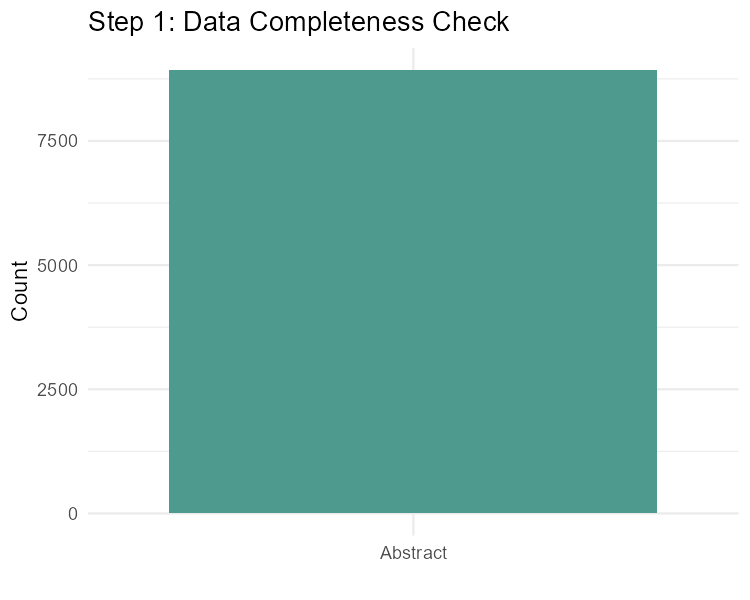

---

### Step 2: Advanced Text Preprocessing
Raw medical text is noisy. We apply several transformations:
1.  **Normalization:** Lowercasing and removing punctuation/numbers.
2.  **Biomedical Stopword Removal:** Beyond standard English stops ("the", "is"), we remove generic research terms ("study", "patient", "analysis") and molecular biology noise ("cell", "protein", "mrna") that appear in almost all papers and blur cluster boundaries.
3.  **Lemmatization:** Reducing words to their root form (e.g., "diabetes" stays "diabetes", while "testing" becomes "test").

*   **Outputs:**
    *   `step2_top_words.png`: Most frequent terms after cleaning.
    *   `step2_length_comparison.png`: How preprocessing reduced the text volume.

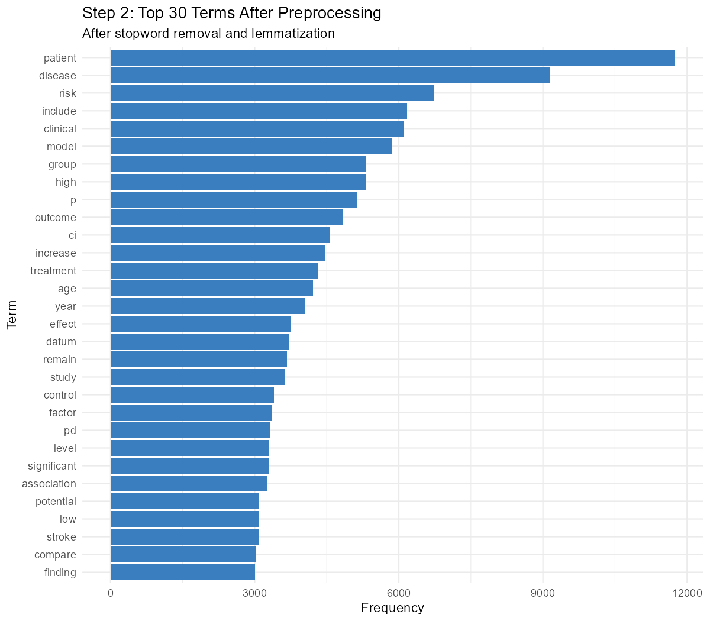
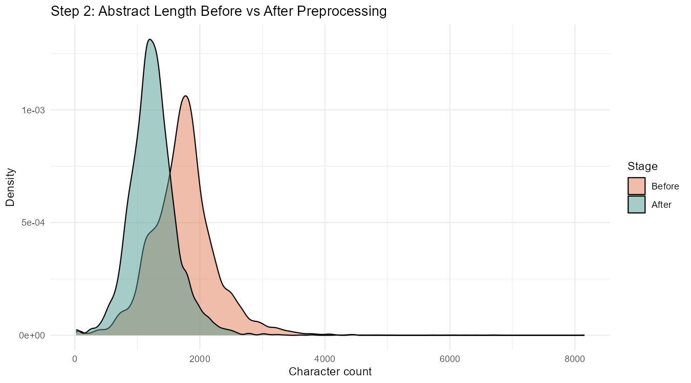

---

### Step 3: TF-IDF Feature Extraction
We convert text into numbers using **TF-IDF (Term Frequency-Inverse Document Frequency)**. This technique highlights words that are important to a specific abstract but not overly common across the entire dataset.
*   **Thresholding:** We only keep terms that appear in at least 20 different abstracts to filter out rare noise.

*   **Outputs:**
    *   `step3_top_tfidf_terms.png`: Words with the highest importance scores.
    *   `step3_term_distribution.png`: How terms are spread across the documents.

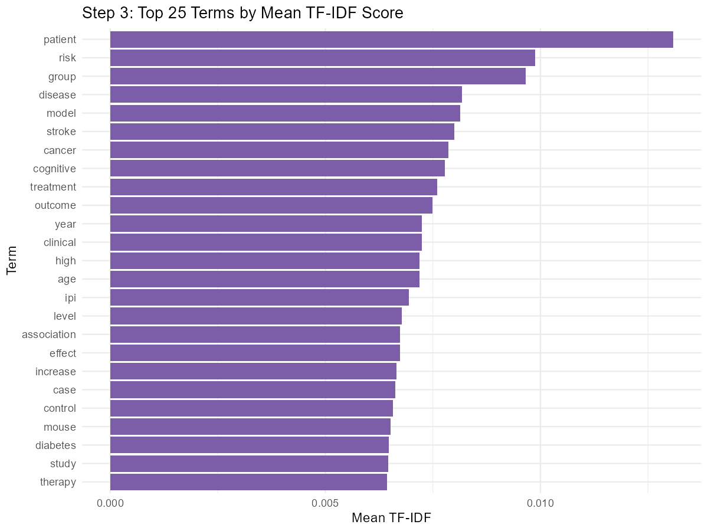

---

### Step 4: UMAP Dimensionality Reduction
The TF-IDF matrix is "high-dimensional" (thousands of columns). We use **UMAP (Uniform Manifold Approximation and Projection)** to compress this into a 2D space. 
*   **Why UMAP?** It preserves the "local" relationships between documents, meaning similar diseases will naturally group together in the plot.

*   **Outputs:**
    *   `step4_umap_raw.png`: The "raw" 2D projection before any clustering is applied.

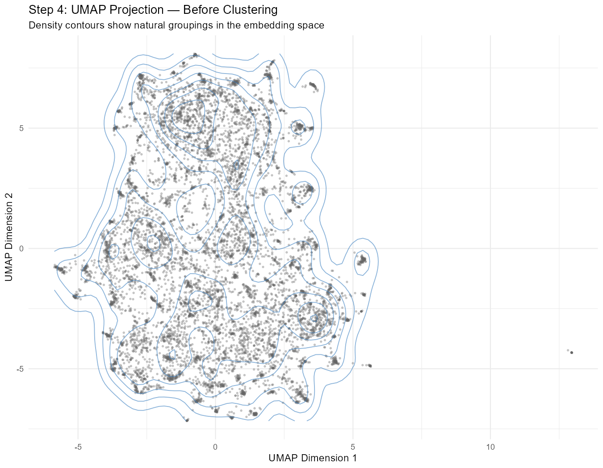

---

### Step 5: Unsupervised Clustering (KMeans & HDBSCAN)
We use two different clustering algorithms:
1.  **KMeans:** Groups documents into a fixed number of clusters ($k=8$ chosen via the Elbow Method).
2.  **HDBSCAN:** A density-based algorithm that automatically finds the number of clusters and identifies "noise" points (outliers).

*   **Outputs:**
    *   `step5_elbow_plot.png`: Justification for choosing 8 clusters.
    *   `step5_kmeans_umap.png`: Documents colored by their KMeans group.
    *   `step5_hdbscan_umap.png`: Documents colored by density-based groups.

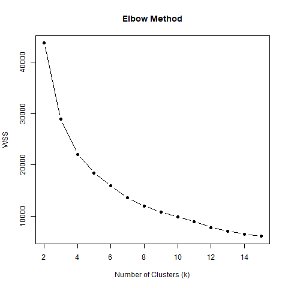
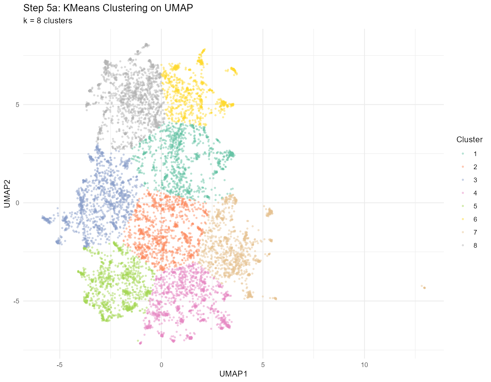

---

### Step 6: Cluster Validation & Evaluation
To ensure our clusters are scientifically meaningful, we calculate:
*   **Silhouette Score:** Measures how similar an abstract is to its own cluster compared to others.
*   **Davies-Bouldin Index:** Measures the "separation" between clusters.

*   **Outputs:**
    *   `step6_silhouette_plot.png`: Detailed view of cluster "tightness."
    *   `step6_cluster_sizes.png`: How many abstracts fall into each disease domain.

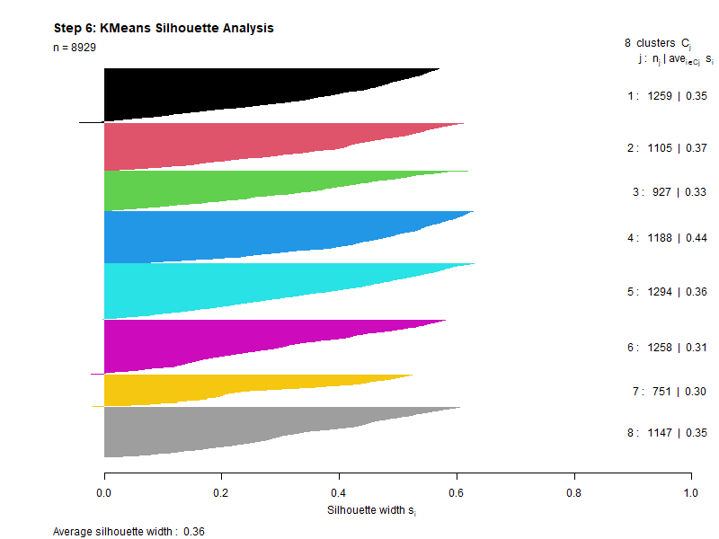
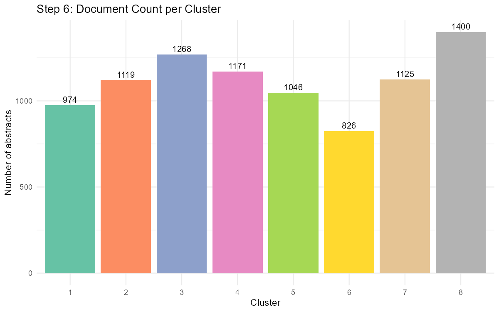

---

### Step 7: Automated Keyword Labeling
We extract the "signature terms" for each cluster using TF-IDF again, but this time treating each cluster as a single large document. This tells us exactly what each group is about (e.g., Cluster 8 is clearly about Neurodegeneration).

*   **Outputs:**
    *   `step7_cluster_keywords.png`: The top 10 defining words for every cluster.

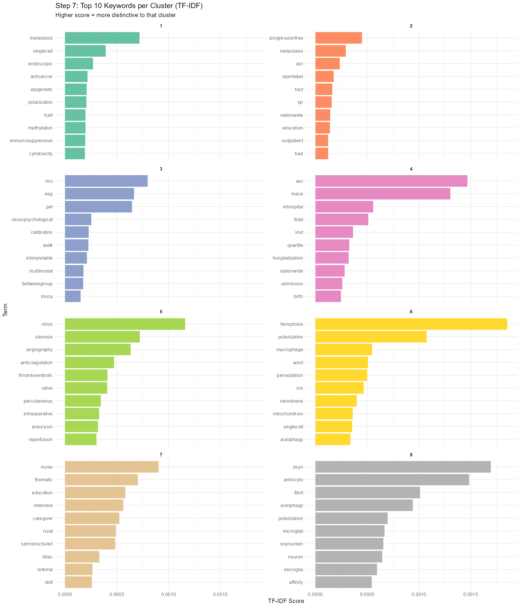

---

### Step 8: The Disease Knowledge Map
The final result is a beautiful, labeled map of the biomedical landscape. We also include a **Cosine Similarity Heatmap** to show which disease domains are most closely related (e.g., how much "Cancer Immunology" overlaps with "Oncology Trials").

*   **Outputs:**
    *   `step8_disease_knowledge_map.png`: The final "Atlas" of diseases.
    *   `step8_similarity_heatmap.png`: Matrix showing relationships between domains.
    *   `step8_signature_terms.png`: The top 3 most unique words per domain.

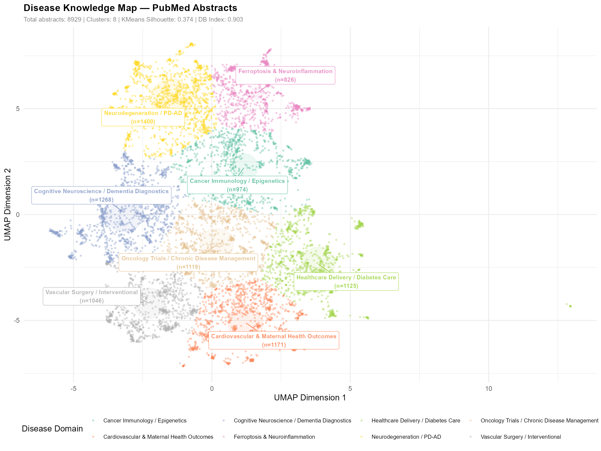
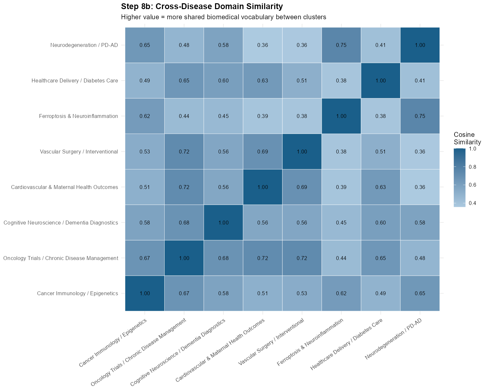

---

## 📈 Key Findings
*   **Cluster 1 (Cancer Immunology):** Dominated by terms like *epigenetic*, *immune*, and *tumor*.
*   **Cluster 8 (Neurodegeneration):** Highly distinct group focusing on *amyloid*, *alzheimer*, and *parkinson*.
*   **Interdisciplinary Links:** The heatmap reveals significant overlap between *Vascular Surgery* and *Cardiovascular Health*, as expected.

## 💻 Tech Stack
*   **Language:** R
*   **Core NLP:** `tm`, `tidytext`, `textstem`
*   **Machine Learning:** `uwot` (UMAP), `dbscan` (HDBSCAN), `stats` (KMeans)
*   **Visualization:** `ggplot2`, `ggrepel`, `reshape2`

---
*Developed as part of the IDS Project — Spring 25-26*
