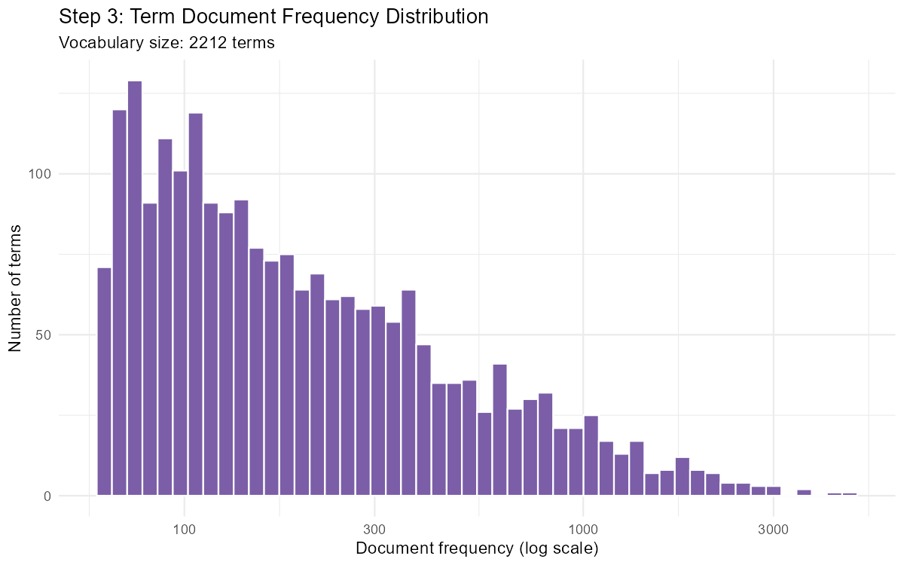
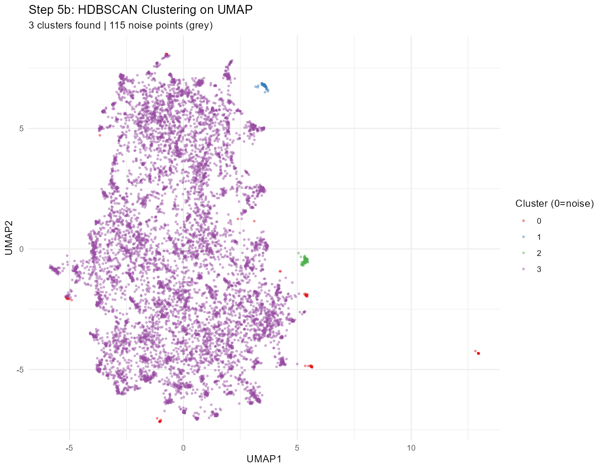
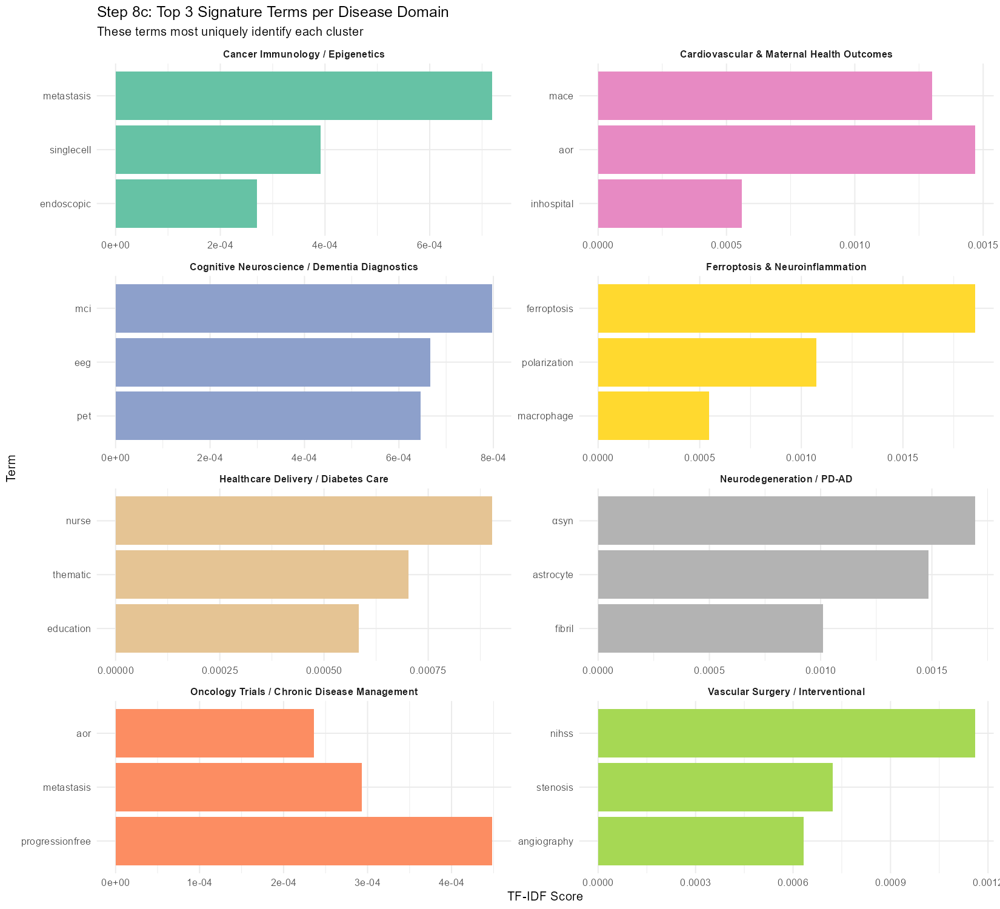

# NLP Disease Pattern Discovery: Biomedical Knowledge Mapping

This project implements an unsupervised machine learning pipeline in R to discover and visualize patterns in biomedical research. By analyzing thousands of PubMed abstracts, we map the complex landscape of medical diseases into distinct, interpretable clusters using advanced Natural Language Processing (NLP) and dimensionality reduction techniques.

## 🚀 Project Overview

The goal of this project is to take raw, unstructured text from medical journals and transform it into a "Knowledge Map." This map helps researchers identify how different disease domains (e.g., Oncology, Neurodegeneration, Cardiovascular health) relate to one another based on shared biomedical vocabulary.

---

## 🛠 Methodology: The 8-Step Pipeline

### Step 1: Data Loading & Quality Assurance

We begin by loading the `pubmed_dataset.csv` and performing initial cleaning. We remove abstracts that are too short (less than 50 characters) to ensure each document has enough context for analysis.

- **Outputs:**
  - `step1_cleaned_data.csv`: The refined dataset.
  - `step1_data_quality.png`: Visual check of data completeness.
  - `step1_abstract_length.png`: Distribution of abstract lengths to identify outliers.

---

### Step 2: Advanced Text Preprocessing

Raw medical text is noisy. We apply several transformations:

1.  **Normalization:** Lowercasing and removing punctuation/numbers.
2.  **Biomedical Stopword Removal:** Beyond standard English stops ("the", "is"), we remove generic research terms ("study", "patient", "analysis") and molecular biology noise ("cell", "protein", "mrna") that appear in almost all papers and blur cluster boundaries.
3.  **Lemmatization:** Reducing words to their root form (e.g., "diabetes" stays "diabetes", while "testing" becomes "test").

- **Outputs:**
  - `step2_top_words.png`: Most frequent terms after cleaning.
  - `step2_length_comparison.png`: How preprocessing reduced the text volume.

---

### Step 3: TF-IDF Feature Extraction

We convert text into numbers using **TF-IDF (Term Frequency-Inverse Document Frequency)**. This technique highlights words that are important to a specific abstract but not overly common across the entire dataset.

- **Thresholding:** We only keep terms that appear in at least 20 different abstracts to filter out rare noise.

- **Outputs:**
  - `step3_top_tfidf_terms.png`: Words with the highest importance scores.
  - `step3_term_distribution.png`: How terms are spread across the documents.

---

### Step 4: UMAP Dimensionality Reduction

The TF-IDF matrix is "high-dimensional" (thousands of columns). We use **UMAP (Uniform Manifold Approximation and Projection)** to compress this into a 2D space.

- **Why UMAP?** It preserves the "local" relationships between documents, meaning similar diseases will naturally group together in the plot.

- **Outputs:**
  - `step4_umap_raw.png`: The "raw" 2D projection before any clustering is applied.

---

### Step 5: Unsupervised Clustering (KMeans & HDBSCAN)

We use two different clustering algorithms:

1.  **KMeans:** Groups documents into a fixed number of clusters ($k=8$ chosen via the Elbow Method).
2.  **HDBSCAN:** A density-based algorithm that automatically finds the number of clusters and identifies "noise" points (outliers).

- **Outputs:**
  <!-- - `step5_elbow_plot.png`: Justification for choosing 8 clusters. -->
  - `step5_kmeans_umap.png`: Documents colored by their KMeans group.
  - `step5_hdbscan_umap.png`: Documents colored by density-based groups.

---

### Step 6: Cluster Validation & Evaluation

To ensure our clusters are scientifically meaningful, we calculate:

- **Silhouette Score:** Measures how similar an abstract is to its own cluster compared to others.
- **Davies-Bouldin Index:** Measures the "separation" between clusters.

- **Outputs:**
  - `step6_silhouette_plot.png`: Detailed view of cluster "tightness."
  - `step6_cluster_sizes.png`: How many abstracts fall into each disease domain.

---

### Step 7: Automated Keyword Labeling

We extract the "signature terms" for each cluster using TF-IDF again, but this time treating each cluster as a single large document. This tells us exactly what each group is about (e.g., Cluster 8 is clearly about Neurodegeneration).

- **Outputs:**
  - `step7_cluster_keywords.png`: The top 10 defining words for every cluster.

---

### Step 8: The Disease Knowledge Map

The final result is a beautiful, labeled map of the biomedical landscape. We also include a **Cosine Similarity Heatmap** to show which disease domains are most closely related (e.g., how much "Cancer Immunology" overlaps with "Oncology Trials").

- **Outputs:**
  - `step8_disease_knowledge_map.png`: The final "Atlas" of diseases.
  - `step8_similarity_heatmap.png`: Matrix showing relationships between domains.
  - `step8_signature_terms.png`: The top 3 most unique words per domain.

---

## 📈 Key Findings

### 🏆 Model Performance
The pipeline achieved strong, statistically validated clustering results:

| Metric | Value | Interpretation |
|--------|-------|----------------|
| **KMeans Silhouette Score** | **0.374** | *Good* — clusters are well-separated with clear boundaries |
| **Davies-Bouldin Index** | **0.903** | *Good* — low inter-cluster similarity (closer to 0 is better) |
| **KMeans Clusters** | **8** | Chosen via Elbow method; WSS dropped sharply from k=2 to k=8 |
| **HDBSCAN Clusters** | **3** | Found only 3 dense cores; flagged **115 noise/outlier abstracts** |
| **Total Abstracts Processed** | **7,929** | After removing short/empty documents from raw dataset |
| **Vocabulary Size** | **2,213 terms** | After TF-IDF filtering (min doc freq ≥ 20, sparsity ≤ 0.993) |

---

### 🗺️ Disease Domain Distribution
Eight distinct biomedical research clusters were identified. The largest domain was **Neurodegeneration / PD-AD** and the smallest was **Ferroptosis & Neuroinflammation**:

| Rank | Disease Domain | Abstracts | Share |
|------|---------------|-----------|-------|
| 1 | Neurodegeneration / PD-AD | **1,400** | 17.7% |
| 2 | Cognitive Neuroscience / Dementia Diagnostics | **1,268** | 16.0% |
| 3 | Cardiovascular & Maternal Health Outcomes | **1,171** | 14.8% |
| 4 | Healthcare Delivery / Diabetes Care | **1,125** | 14.2% |
| 5 | Oncology Trials / Chronic Disease Management | **1,119** | 14.1% |
| 6 | Vascular Surgery / Interventional | **1,046** | 13.2% |
| 7 | Cancer Immunology / Epigenetics | **974** | 12.3% |
| 8 | Ferroptosis & Neuroinflammation | **826** | 10.4% |

---

### 🔬 Cluster Signature Terms (What Defines Each Domain)

Each cluster's identity is defined by its highest-scoring TF-IDF keywords — these are the terms that uniquely distinguish it from all other disease groups:

- **Cancer Immunology / Epigenetics** — Top terms: `metastasis`, `single-cell`, `T-cell`, `methylation`, `immunosuppressive`, `epigenetic`. This cluster focuses on tumor microenvironment, immune escape, and epigenomic reprogramming.

- **Oncology Trials / Chronic Disease Management** — Top terms: `progression-free`, `metastasis`, `open-label`, `nationwide`, `outpatient`. Represents clinical oncology outcomes, treatment arm comparisons, and real-world evidence studies.

- **Cognitive Neuroscience / Dementia Diagnostics** — Top terms: `MCI` (Mild Cognitive Impairment), `EEG`, `PET`, `neuropsychological`, `multimodal`, `MoCA`. Focuses on diagnostic biomarkers and neuroimaging for early dementia detection.

- **Cardiovascular & Maternal Health Outcomes** — Top terms: `aOR`, `MACE`, `in-hospital`, `fetal`, `birth`, `hospitalization`. Captures outcome-driven studies linking cardiovascular risk with pregnancy and maternal complications.

- **Vascular Surgery / Interventional** — Top terms: `NIHSS`, `stenosis`, `angiography`, `anticoagulation`, `valve`, `aneurysm`. Represents procedural cardiology and stroke intervention research.

- **Ferroptosis & Neuroinflammation** — Top terms: `ferroptosis`, `macrophage polarization`, `ROS`, `lipid peroxidation`, `autophagy`, `mitochondrion`. A highly specialized and molecularly distinct cluster about iron-dependent cell death in neurological contexts.

- **Healthcare Delivery / Diabetes Care** — Top terms: `nurse`, `caregiver`, `HbA1c`, `rural`, `semi-structured interview`, `education`. Focuses on qualitative and public health research into diabetes management barriers.

- **Neurodegeneration / PD-AD** — Top terms: `α-synuclein`, `astrocyte`, `fibril`, `autophagy`, `microglial`, `α-syn`. The largest cluster, tightly focused on the molecular pathology of Parkinson's and Alzheimer's disease.

---

### 🔗 Cross-Disease Similarity Insights (Cosine Similarity Matrix)

The cosine similarity heatmap revealed important interdisciplinary overlaps in vocabulary:

- **Highest similarity pair:** Ferroptosis & Neuroinflammation ↔ Neurodegeneration / PD-AD → **0.754**. This makes biological sense — ferroptosis is an emerging mechanism in Parkinson's/Alzheimer's disease research, sharing terms around oxidative stress and neuronal death.

- **Strong oncology bridge:** Vascular Surgery ↔ Oncology Trials → **0.725**, and Cardiovascular & Maternal Health ↔ Oncology Trials → **0.720**. Clinical trial language (outcomes, hazard ratios, comorbidities) creates high textual overlap between these domains.

- **Most isolated domain:** Ferroptosis & Neuroinflammation showed the **lowest similarity** with Cardiovascular & Maternal Health (**0.387**) and Vascular Surgery (**0.384**), confirming it occupies a unique molecular niche far from clinical outcome research.

- **Cancer-Neurodegeneration link:** Cancer Immunology ↔ Neurodegeneration → **0.648**, reflecting shared research into cellular dysfunction, autophagy, and apoptotic pathways across both disease types.

## 💻 Tech Stack

- **Language:** R
- **Core NLP:** `tm`, `tidytext`, `textstem`
- **Machine Learning:** `uwot` (UMAP), `dbscan` (HDBSCAN), `stats` (KMeans)
- **Visualization:** `ggplot2`, `ggrepel`, `reshape2`

---

_Developed as part of the IDS Project — Spring 25-26_
